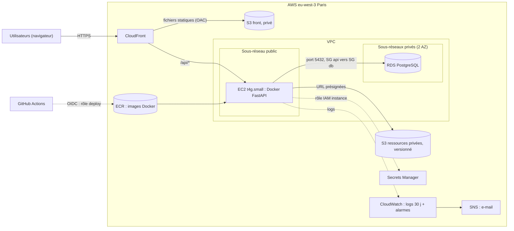

# C1 — Architecture AWS pour MATRiCE

Région retenue : eu-west-3 (Paris)

## 1. Contexte et hypothèses

La MATRice est en : 
- front = React
- API = fastAPI
- BDD = PostgreSQL

Avec une charge faible. 

| Hypothèse | Valeur | Conséquence |
|---|---|---|
| Utilisateurs simultanés | 25 | une petite instance suffit |
| Séances | 10 000 | base de quelques Mo, 20 Go de disque largement assez |
| Ressources privées | 2 Go | S3, accès contrôlé par l'API |
| Pointe | 20 req/s | pas besoin de répartiteur de charge ni d'auto-scaling |
| Logs | 30 jours | rétention CloudWatch réglée à 30 jours |
| RPO / RTO | 24 h / 4 h | sauvegarde quotidienne minimum ; restauration manuelle acceptable |

Région Paris : données hébergées en France (RGPD), latence faible pour les utilisateurs.

## 2. Deux architectures comparées

### Architecture A — API sur EC2 (retenue)
- Front : build React dans un bucket S3 privé, servi par CloudFront (accès via OAC).
- API : FastAPI dans un conteneur Docker sur une instance EC2 t4g.small (Graviton), sous-réseau public. Security Group : entrée HTTPS uniquement depuis CloudFront (liste de préfixes gérée AWS), SSH fermé, administration via SSM Session Manager.
- Base : RDS PostgreSQL db.t4g.micro, Single-AZ, 20 Go gp3, sous-réseaux privés, pas d'accès public.
- Ressources privées : bucket S3 privé, versionné, chiffré ; téléchargement par URL présignée générée par l'API.

### Architecture B — API sur Lambda
- Front : identique (S3 + CloudFront).
- API : FastAPI dans Lambda (adaptateur Mangum) derrière API Gateway HTTP API.
- Base : identique (RDS privé). Lambda doit être placée dans le VPC pour joindre RDS.

### Comparaison

| Critère | A — EC2 | B — Lambda |
|---|---|---|
| Coût calcul | fixe (instance allumée 24/7) | quasi nul à cette charge (offre gratuite) |
| Démarrage | aucun délai | « cold start » après inactivité |
| Maintenance | mises à jour OS à faire | aucune |
| Réutilise Docker / CI-CD existants | oui, directement | adaptation du code nécessaire |
| Connexions PostgreSQL | pool stable | risque de trop de connexions → RDS Proxy (payant) |
| Accès aux secrets depuis le VPC | direct | point de terminaison VPC ou NAT (payant) |
| Retour arrière | redéployer l'image précédente | publier la version précédente (alias) |

Ma conclusion : Malgré de bonnes choses sur la piste B, elle est pertinente mais seulement si la charge devenait très irrégulière. Ici, on a une charge faible et stable, docker est déjà en place. On a pas de cold start et moins de pièces réseau. 

### Services écartés
| Service | Pourquoi écarté |
|---|---|
| Load Balancer (ALB) | une seule instance, 20 req/s : coût fixe sans bénéfice |
| NAT Gateway | coût fixe élevé ; inutile car l'EC2 est en sous-réseau public filtré |
| RDS Multi-AZ | double le coût ; le RTO de 4 h tolère une restauration |
| ECS / EKS | orchestration surdimensionnée pour un seul conteneur |
| Aurora | plus cher que RDS pour cette taille |
| EC2 pour le front | des fichiers statiques n'ont pas besoin de serveur |

## 3. Schéma

Légende : trait plein = requête ou flux de données ; pointillé = identité ou permission.

## 4. Sécurité et exploitation

**IAM**
- Compte root : MFA, jamais utilisé au quotidien.
- Accès humains via IAM Identity Center, avec MFA.
- Rôle de l'instance EC2 : lire *un* secret, écrire ses logs, lire/écrire *un* bucket. Rien d'autre (moindre privilège).
- Déploiement : GitHub Actions obtient un rôle temporaire par OIDC. Aucune clé d'accès stockée dans GitHub.

**Secrets**
- Mot de passe de la base dans Secrets Manager, lu au démarrage par l'API via le rôle de l'instance.
- Aucun secret dans le code, l'image Docker ou le dépôt.

**Sauvegarde / restauration**
- RDS : sauvegardes automatiques avec rétention de 7 jours, restauration à un instant précis (PITR).
- Snapshot manuel avant chaque migration de schéma.
- S3 : versionnage activé (un fichier supprimé ou écrasé peut être récupéré).

**Logs et alertes**
- Logs de l'API et de RDS dans CloudWatch Logs, rétention de 30 jours.
- Alarmes envoyées par e-mail (SNS) :
  - l'API ne répond plus (health check) ;
  - taux d'erreurs 5xx élevé ;
  - espace disque RDS faible ;
  - budget mensuel dépassé (AWS Budgets).

**Retour arrière**
- Chaque image Docker est taguée avec le commit. Revenir en arrière = relancer le conteneur avec le tag précédent.
- Front : le build précédent reste dans S3 (versionnage). On le remet en place puis on invalide le cache CloudFront.
- Base : migrations compatibles avec la version précédente de l'API ; sinon, restauration du snapshot pris avant la migration.

## 5. Estimation des coûts

Source : AWS Pricing Calculator, région Europe (Paris), exportée le 06/10/2026.

Estimation partagée : https://calculator.aws/#/estimate?id=e40f82e296870055d854fa09c5f76815e5b1237e

Export PDF : `preuves/c1-estimation-aws.pdf`

Les montants du calculateur **excluent l'offre gratuite** : ce sont des maximums.

| Poste | Volume / hypothèse | Calcul | Coût mensuel (USD) |
|---|---|---|---|
| EC2 t4g.small | 1 instance Linux, à la demande, 730 h | 730 h × 0,0188 $/h = 13,72 | 15,58 |
| └ dont disque EBS gp3 | 20 Go | 20 Go × 0,093 $/Go = 1,86 | (inclus) |
| RDS PostgreSQL db.t4g.micro | Single-AZ, à la demande, 730 h | 730 h × 0,018 $/h = 13,14 | 15,80 |
| └ dont stockage gp3 | 20 Go | 20 Go × 0,133 $/Go = 2,66 | (inclus) |
| S3 Standard | 2 Go de ressources privées | 2 Go × 0,025 $/Go | 0,05 |
| CloudFront | 20 Go sortants + 1,6 M requêtes HTTPS | calculateur | 3,30 |
| CloudWatch | 2 Go de logs ingérés, conservation 1 mois, 5 alarmes | calculateur | 1,71 |
| Secrets Manager | 1 secret | 1 × 0,40 $ | 0,40 |
| ECR | 1 Go d'images Docker | calculateur | 0,10 |
| IPv4 publique | 1 adresse, 730 h | 730 h × 0,005 $/h | 3,65 |
| **Total** | | | **40,59** |

Soit **487,08 USD sur 12 mois**.

### Calcul des volumes

**Requêtes à l'API**
- 25 utilisateurs simultanés, une action toutes les 12 s environ → 25 ÷ 12 ≈ 2 req/s en moyenne.
- Utilisation 10 h par jour, 22 jours ouvrés par mois.
- 2 × 3 600 × 10 × 22 = 1 584 000 ≈ **1,6 million de requêtes/mois**.
- La pointe de 20 req/s sert à dimensionner le serveur. La moyenne sert à estimer la facture : 20 req/s en continu donnerait 52 millions de requêtes, soit 30 fois trop.

**Trafic CloudFront**
- Réponses de l'API : 1,6 M × 5 Ko = 8 Go.
- Front : 50 chargements par jour × 1 Mo × 22 jours ≈ 1,1 Go.
- Total ≈ 9 Go, arrondi à **20 Go** avec une marge ×2.

**Logs**
- 1 ligne par requête ≈ 500 octets → 1,6 M × 500 o = 0,8 Go, plus les erreurs et les logs RDS ≈ 1 Go.
- Avec la marge ×2 : **2 Go ingérés par mois**.
- Le calculateur estime le stockage à 15 % du volume ingéré (compression), pour une conservation d'un mois.

Valeurs hypothétiques.

### Analyse

- **Deux postes font 78 % de la facture** : RDS (15,80 dollars, 39 %) et EC2 (15,58 dollars, 38 %).

Ces ressources sont allumées 24h/24

- **Tout ce qui dépend du trafic coûte peu** : CloudFront, logs et S3 font environ 5 $ au total. 

Doubler le nombre d'utilisateurs ne changerait pas grand chose. 

- **Piste d'économie : Savings Plan sur 1 an.** Le calculateur donne 5,91 dollars/mois pour l'instance EC2 (EC2 Instance Savings Plan, sans frais initiaux) au lieu de 13,72 $, soit −7,81 dollars/mois. 

Étant donné que la MATRiCE tourne sur une année scolaire, ça m'a semblé pertinent.

- **Instances Spot écartées** malgré leur prix (3,98 $/mois) : AWS peut reprendre l'instance à tout moment, ce qui est incompatible avec une API qui doit rester disponible.

- **Offre gratuite** : CloudFront et CloudWatch ont une offre gratuite qui pourrait ramener ces lignes à 0 $. Le calculateur ne l'applique pas donc on a fait une estimation prudente. 

## 6. Protocoles

### API indisponible
1. **Détection** : l'alarme health check envoie un e-mail. Vérifier soi-même l'URL `/api/health`.

2. **Diagnostic** :
   - l'état de l'instance EC2 dans la console ;
   - les logs du conteneur dans CloudWatch ;
   - l'état de RDS ;
   - le dernier déploiement.

3. **Action selon la cause** :
   - conteneur arrêté → le redémarrer ;
   - déploiement fautif → relancer l'image précédente (retour arrière) ;
   - instance défaillante → en relancer une depuis le modèle de lancement, puis redéployer l'image ;
   - base indisponible → voir le protocole de restauration.

4. **Vérification** : `/api/health` répond, un utilisateur peut afficher le planning.

5. **Communication et suite** : prévenir les utilisateurs, noter la durée de l'incident, la cause et ce qui évitera qu'il se reproduise.

### Restauration de la base
1. Choisir le point de restauration (PITR) : juste avant l'incident.

2. Restaurer vers une **nouvelle** instance RDS. On ne touche jamais à l'ancienne, qu'on garde pour analyse.

3. Vérifier les données : nombre de séances, dernières modifications.

4. Pointer l'API vers la nouvelle instance (mettre à jour le secret), puis redémarrer le conteneur.

5. Vérifier l'application, puis supprimer l'ancienne instance une fois l'incident clos.

6. **Test** : faire cette restauration à blanc et mesurer sa durée.

## 7. Discussion RPO / RTO

Objectifs du sujet : **RPO 24 h** (perte de données maximale acceptée) et **RTO 4 h** (délai maximal pour que le service remarche).

### RPO : combien de données peut-on perdre ?

- **Base de données** : RDS fait une sauvegarde automatique chaque jour et conserve les journaux de transactions. On peut donc restaurer la base à n'importe quel instant des 7 derniers jours (PITR). En pratique, la perte se limite à quelques minutes. 
- **Fichiers privés (S3)** : le versionnage garde les anciennes versions. 
- **Code et front** : chaque version est conservée dans les Releases GitHub et dans ECR. 

L'objectif de 24 h serait déjà atteint avec la seule sauvegarde quotidienne. Le PITR offre une marge confortable sans coût supplémentaire, puisqu'il est inclus dans RDS.

### RTO : combien de temps pour revenir ?

Estimation du temps de remise en service dans le pire cas courant (base perdue) :

| Étape | Durée estimée |
|---|---|
| Détection (alarme) et diagnostic | 15 à 30 min |
| Restauration RDS vers une nouvelle instance (base de petite taille) | 20 à 40 min |
| Vérification des données | 15 min |
| Mise à jour du secret et redémarrage de l'API | 10 min |
| Vérification finale | 10 min |
| **Total** | **≈ 1 h 10 à 1 h 45** |

Si seule l'API tombe, le retour à l'image Docker précédente prend moins de 15 minutes.

On reste sous les 4 h avec de la marge. C'est pour cela que le Multi-AZ n'est pas retenu : il réduirait le temps de bascule à quelques minutes, mais doublerait le coût de la base pour un objectif que l'on tient déjà. 

On ne couvre par la panne sur toute la région. 

## 8. Limites
- **Une seule instance pour l'API.**
Si l'EC2 tombe, l'API est indisponible le temps de la relancer (voir protocole).

- **Base en Single-AZ.**
Une panne de la zone de disponibilité rend la base indisponible jusqu'à la restauration. 

- **Pas de reprise si toute la région Paris tombe.**

- **Volumes estimés, pas mesurés.**

- **Prix datés, ils peuvent changer**

- **API exposée en sous-réseau public.**

- **Durée de restauration non testée.**

- **Rien n'a été déployé.**

## Sources
- AWS Pricing Calculator : https://calculator.aws/ 
- Tarifs EC2 : https://aws.amazon.com/ec2/pricing/on-demand/ 
- Tarifs RDS PostgreSQL : https://aws.amazon.com/rds/postgresql/pricing/ 
- Tarifs S3 : https://aws.amazon.com/s3/pricing/ 
- Tarifs CloudFront : https://aws.amazon.com/cloudfront/pricing/ 
- Tarifs CloudWatch : https://aws.amazon.com/cloudwatch/pricing/ 
- Sauvegardes RDS : https://docs.aws.amazon.com/AmazonRDS/latest/UserGuide/USER_WorkingWithAutomatedBackups.html