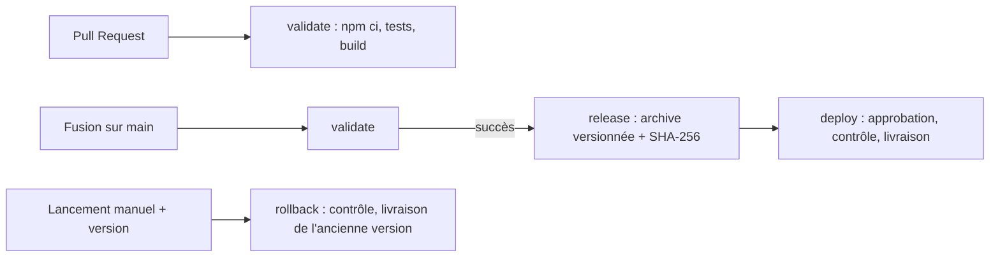

# C2 — Chaîne CI/CD

Callista Loré — 06.10.26
Workflow : `.github/workflows/ci-cd.yml` — projet livré : `f2-tests-front` (React + Vite)

## 1. Audit de la situation de départ

| Problème constaté | Risque | Correction mise en place |
|---|---|---|
| Compte administrateur partagé | impossible de savoir qui a fait quoi ; un départ oblige à changer le mot de passe pour tous | un compte GitHub par personne avec 2FA ; le déploiement est fait par le workflow, pas par une personne |
| `git pull` de la branche principale sur le serveur | on livre du code non testé, non construit, différent d'un serveur à l'autre | le serveur ne reçoit plus que l'archive construite et testée par la CI |
| Installation non verrouillée | deux installations peuvent donner des versions différentes des dépendances | `npm ci` : installe exactement le `package-lock.json`, échoue s'il est incohérent |
| Tests non bloquants | du code cassé part en production | `release` et `deploy` dépendent de `validate` (`needs`) ; la règle de branche interdit de fusionner si `validate` échoue |
| Secrets dans le dépôt | toute personne qui lit le dépôt (ou son historique) peut les utiliser | secrets retirés, changés (rotation), stockés dans GitHub Secrets ou un coffre ; voir §4 |
| Aucun artefact antérieur | impossible de revenir à la version précédente rapidement | chaque version est publiée dans les Releases GitHub avec son empreinte SHA-256 |
| Sauvegardes jamais restaurées | on ne sait pas si elles fonctionnent | hors du périmètre du front ; préconisation : test de restauration planifié (voir C1) |

## 2. Fonctionnement du workflow

- **Sur une Pull Request** : seul `validate` tourne. Une PR ne peut rien publier ni livrer.
- **Sur `main`** (après fusion) : `validate` → `release` → `deploy`. Chaque job ne démarre que si le précédent a réussi.
- **Retour arrière** : lancement manuel en indiquant une version déjà publiée ; rien n'est reconstruit.

**Artefact versionné** : le `dist/` produit par `validate` est réutilisé tel quel. On livre exactement ce qui a été testé. L'archive `front-vN.tar.gz` est accompagnée de son empreinte `front-vN.tar.gz.sha256`.

**Contrôle avant livraison** : avant de livrer, le job vérifie l'empreinte (`sha256sum -c`), décompresse l'archive et vérifie la présence de `index.html`.

## 3. Permissions minimales

- Par défaut, le jeton du workflow n'a que la **lecture** (`permissions: contents: read`), et le réglage du dépôt est aussi en lecture seule.
- Seul le job `release` reçoit `contents: write`, nécessaire pour créer la release.
- `persist-credentials: false` : le jeton n'est pas laissé sur la machine après le checkout, une dépendance malveillante lancée par `npm` ne peut pas le récupérer.
- Les livraisons passent par l'environnement **production**, qui exige une **approbation manuelle**.
- `concurrency: production` empêche deux livraisons simultanées.

## 4. Secrets

- Ce workflow n'a besoin d'**aucun secret** : il n'utilise que le jeton temporaire fourni par GitHub.
- Pour une vraie livraison sur AWS (voir C1), on utiliserait **OIDC** : GitHub obtient un rôle AWS temporaire, sans clé stockée.
- Si un secret a été commité :
  1. le considérer comme compromis et le **changer** immédiatement ;
  2. le retirer du code et de l'historique (`git filter-repo`) ;
  3. le stocker dans GitHub Secrets (ou un coffre) et l'injecter par variable d'environnement ;
  4. activer **secret scanning** et **push protection** sur le dépôt pour bloquer les prochains.

## 5. Contributions non fiables

- Le workflow se déclenche avec `pull_request` et non `pull_request_target`. Une PR venant d'un fork tourne donc **sans secrets** et avec un jeton en **lecture seule**.
- Le code d'une PR n'est jamais livré : `release` et `deploy` ne tournent que sur `main`.
- La branche `main` est protégée : fusion uniquement par PR, avec `validate` vert obligatoire.
- La saisie manuelle du retour arrière est **contrôlée** (format `front-vN`) et passée par variable d'environnement, pour empêcher l'injection de commandes.

## 6. Séparation validation / déploiement

| | Validation | Déploiement |
|---|---|---|
| Quand | chaque PR et chaque push sur `main` | uniquement après fusion sur `main`, ou retour arrière manuel |
| Droits | lecture seule | écriture (release) + environnement protégé |
| Approbation | aucune | manuelle |
| Peut livrer ? | non | oui |

## 7. Preuves

| Preuve | Fichier |
|---|---|
| Validation sur PR (release/deploy ignorés) | `preuves/c2-pr-validation.png` |
| Succès complet + release | `preuves/c2-merging.png` | 
| Échec d'un test → PR bloquée | `preuves/c2-echec.png` |
| Retour arrière | `preuves/c2-rollback.png` |

## 8. Procédure de retour à l'artefact précédent

1. Repérer dans **Releases** la dernière version saine 
2. **Actions → CI/CD front → Run workflow**, branche `main`, saisir la version.
3. Approuver le déploiement dans l'environnement **production**.
4. Le job vérifie le format de la version, télécharge l'archive, contrôle l'empreinte puis livre.
5. Vérifier le site, puis corriger le problème par une nouvelle PR. Le correctif suivra le circuit normal.

Durée observée : quelques secondes entre le lancement et la fin du job.

## 9. Limites

- La livraison est **simulée** : pas de serveur ni de compte AWS (hors périmètre).
- Les actions GitHub sont référencées par version majeure (`@v7`). Les fixer par empreinte de commit (SHA) protégerait contre une modification de l'action.
- L'approbation de production est faite par la même personne que l'auteur des PR. En équipe, on exigerait un second relecteur.
- Le numéro de version suit le compteur d'exécutions du workflow : il n'est pas continu (les PR consomment aussi des numéros).
- Seul le front est couvert ; l'API et la base auraient besoin de leurs propres étapes (tests, migrations, sauvegarde avant livraison).
- Le test de restauration des sauvegardes est préconisé mais pas automatisé ici.